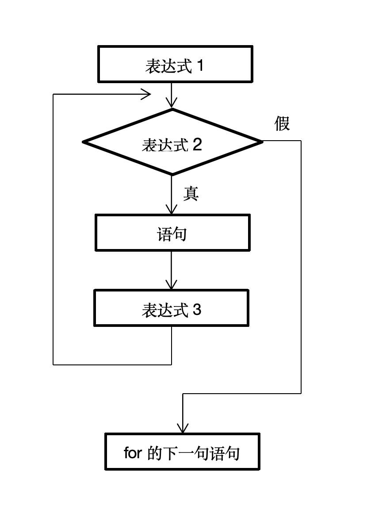

# 循环结构
首先要讲到为什么要使用循环结构。例如当我们需要求1~100自然数之和，这个时候是不能用常规方法手工输入1~100个整数然后让计算机去进行计算的。如果那样的话，有1000或者更多的数字需要计算时怎么办？这个时候就需要用到循环结构。例如上面的问题有这样的解决方法：

```c
#include<stdio.h>
int main( )
{
    int  i , s;
    s = 0;
    for(i = 1 ; i <= 100 ; i ++)
    {
        s = s + i;
    }
    printf(“%d” , s);
    return  0;
}
```
这个程序的运行结果是：

> 5050

常用的循环结构有：for、while、do…while三种，三种循环结构的功能相同，但各有各的特点，所以它们各自能实现不同的功能。同时它们各自可以互相嵌套，还可以改变循环的状态，所以，善用循环结构往往能减少巨大的工作量，让电脑代替人脑完成一些人脑无法完成的工作。

## 1.while与do…while循环结构
while结构的一般形式是：

```c	
while(表达式) 
    语句;
```

这个结构的运行过程是，首先判断表达式的真假，如果为真，则执行语句。语句可以为语句体，此时需要用花括号将语句体括起来。在while后面执行的语句（体）称为循环体。

do…while结构的一般形式是：

```c
do
    语句;
while(表达式)
```

这个程序的运行过程是，首先执行语句（体），再判断表达式真假，如果表达式为真，再进行循环。

## 2.for 循环结构
除了上述的两种循环结构外，C语言还提供了另外一种更加灵活的for循环结构。它完全可以代替while和do…while语句。for语句的一般形式是：

```c
for(表达式1 ; 表达式2 ; 表达式3)
    语句;
```

三个表达式的作用都不相同。表达式1设置初始条件，执行一次，可以没有、一个、或者多个；表达式2为判断是否执行循环的条件，当表达式2的值为真时，执行循环体；表达式3为循环的变化量，可以没有、一个或多个，执行一次。所以for语句的一般形式可以理解为：

```c
for(赋初值 ; 循环条件 ; 增量)
    语句;
```

for语句的一种极端形式是：

```c
for( ; ; )
```

这句语句与
```c
while(1)
```
是等价的，代表无条件循环。

for循环体的执行过程是，先执行表达式1，然后判断表达式2的真假，如果为真，执行语句，语句可以为语句体。语句（体）执行过后，执行表达式3，for的循环体到此执行完一次循环。整个过程如下图：


可以将for循环结构改写为while循环结构：

```c
表达式1;
while (表达式2)
{
    语句;
    表达式3;
}
```

上述结构与for一般形式的循环结构完全等价。基于这种原理，我们可以将之前提到的求1~100自然数和的程序改写：

```c
int  i , s = 0;
while(i <= 100)
{
    s = s + i;
    i ++;
}
```

```c
int  i , s = 0;
do
{
    s = s + i;
    i ++;
}
while(i <= 100)
```

## 3.循环结构的嵌套
上述三种循环结构的优缺点各不相同，在解决程序设计问题时各自能解决不同特征的问题。三种结构可以互相嵌套，实现更强大的功能。当进行设计比较复杂的循环问题时，应该注意代码的规范性，即每层嵌套之间有一个Tab键的缩进，这样的话代码看上去有层次感，一眼望去能看出都哪几行代码属于一个层次。便于别人阅读也便于自己修改。

具体的循环嵌套问题还要在日后解决问题中慢慢理解。

## 4.改变循环结构的状态
当我们解决问题时，往往会遇到需要提前终止循环的情况。例如我们想要求1~一个很大的自然数中所有质数的和，这样我们设置一个1~很大的数的循环，每次遇到质数就把这个数加在和变量中，判断不是质数的话就跳过本次循环。这种方式叫做改变循环的状态。

在C语言中，有两种改变循环状态的方式：break与continue。为了讲解这两种方式，我们分别举不同的例子。

例如，我们在全校1000名同学范围内筹集资金，当资金数累计到十万元的时候就停止筹集。统计此时捐款人数。我们可以这样编写程序：

```c
#include<stdio.h>
int main( )
{
    float  num , sum = 0;
    int  i;
    for(i = 0 ; i < 1000 ; i ++)
    {
        printf(“输入捐款金额：”);
        scanf(“%f” , &num);
        printf(“\n”);
        sum = sum + num;
        if(sum >= 100000)
        	break;
    }
    printf(“有%d人参加捐款。\n” , i);
    return  0;
}
```

在程序中可以看出，在第13行程序判断sum >= 100000是否成立，成立的话程序遇到break，跳出整个循环。再看下面的例子。输出1~100之间可以被3整除的数，程序如下：

```c
#include<stdio.h>
int  main( )
{
    int  i;
    for(i = 0 ; i <= 100 ; i ++)
    {
        if(i % 3 != 0)
           continue;
        printf(“%d\t” , i);
    }
    printf(“输出完毕！\n”);
    return  0;
}
```

在程序中可以看出，当程序遇到continue时，跳过本次循环，但循环还在继续。这时候需要自己体会二者的差别。