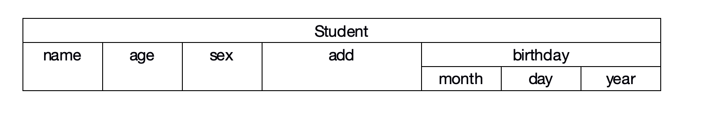

# 结构体的概念与定义
在前面的学习中，变量大多都是互相独立的，即使是内存中的地址也是互相毫无干系的。即使是数组，也只是要求其中的元素必须是同样的类型。那么可以不可以有一种结构，可以将一些不同类型的变量放在一起，而他们又具有一定的联系呢？例如一个学生的资料，其中有学号、姓名、性别、年龄、地址。C语言中允许用户自己建立由不同类型数据组成的组合型数据结构，叫做“结构体”。可以理解为结构体也是一种数据类型，例如下面是一个自行创建的结构体类型：

```c
struct  Student
{
    int  num;
    char  name[20];
    char  sex;
    int  age;
    char  add[30];
} ;
```

struct是结构体类型的标识符，Student是用户自定义的结构体名称，就像int  a中的a是变量名称一样。这个结构体中有5个成员，分别是num、name、sex、age、add，它们各自有自己的数据类型。这个结构体在内存中占4 + 20 + 1 + 4 + 30 = 59字节。上面定义的结构体可以这样示意：

|||Student|||
|:-:|:-:|:-:|:-:|:-:|
|num|name|sex|age|add|


定义结构体的一般形式为：

```c
struct  结构体名
{
    //成员表列
    类型名  成员名;
} ;
```

定义结构体的时候不要忘了末尾有分号。结构体表现的是“包含”关系，如上例即表示Student中包含了num、name、sex、age、add五个元素。当然，结构体的成员可以属于另外一个结构体，例如：

```c
struct  Date
{
    int  month;
    int  day;
    int  year;
} ;
struct  Student
{
    char  name[20];
    int  age;
    char  sex;
    char  add[30];
    struct  Date  birthday;
} ;
```

这个时候，此结构体的结构如下图所示：

